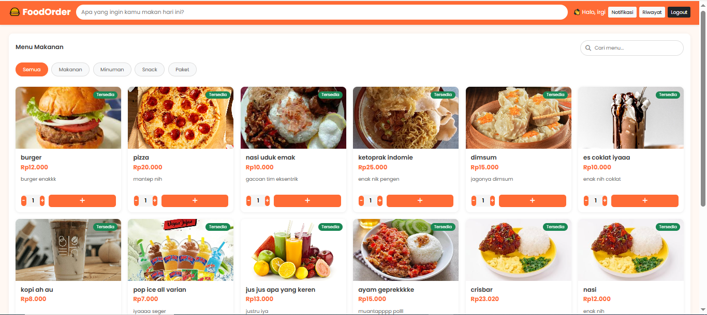
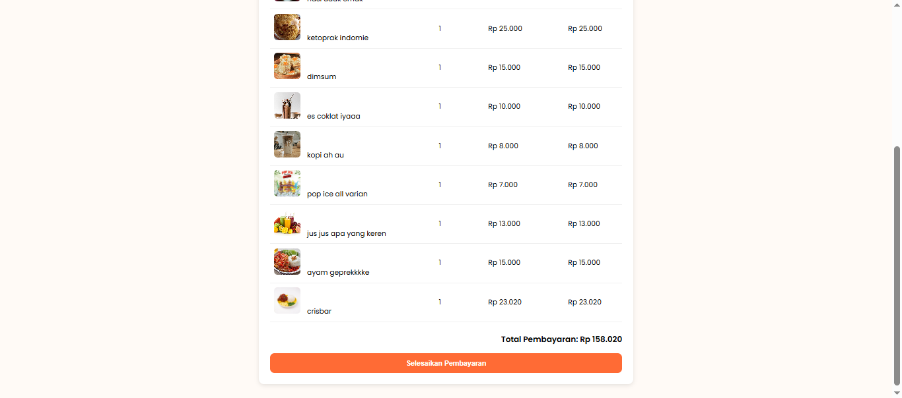
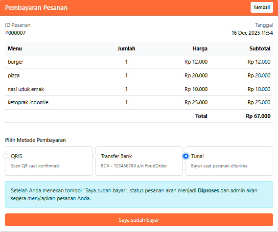
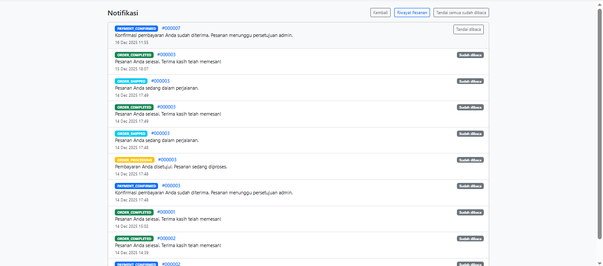

# Food Order Application

Aplikasi pemesanan makanan online berbasis web yang memungkinkan pengguna untuk memesan makanan dan minuman secara online. Aplikasi ini memiliki dua jenis pengguna: admin dan pelanggan.

## Fitur

### Untuk Pelanggan
- Registrasi dan login pengguna
- Melihat daftar menu makanan dan minuman
- Menambahkan menu ke keranjang belanja
- Melakukan checkout pesanan
- Melihat riwayat pemesanan
- Menerima notifikasi status pesanan
- Konfirmasi pembayaran

### Untuk Admin
- Login admin
- Manajemen menu (tambah, edit, hapus)
- Melihat daftar pesanan
- Mengupdate status pesanan
- Manajemen pengguna
- Dashboard ringkasan

## Teknologi yang Digunakan
- **Frontend**: HTML, CSS, JavaScript
- **Backend**: PHP
- **Database**: MySQL
- **Server**: XAMPP/Apache
- **Lainnya**: Bootstrap untuk tampilan responsif

## Persyaratan Sistem
- PHP 7.4 atau lebih baru
- MySQL 5.7 atau lebih baru
- Web server (XAMPP, WAMP, LAMP, atau MAMP)
- Web browser terbaru (Chrome, Firefox, Safari, dll.)

## Instalasi

1. Clone repository ini ke dalam folder htdocs (XAMPP) atau www (WAMP/LAMP) Anda:
   ```
   git clone [repository-url] foodorder
   ```

2. Buat database baru di phpMyAdmin dengan nama `foodorder`

3. Import file database yang ada di folder `database/foodorder.sql` ke dalam database yang baru dibuat

4. Sesuaikan konfigurasi koneksi database di file `includes/config.php`

5. Akses aplikasi melalui browser:
   ```
   http://localhost/foodorder
   ```

## Akun Default

### Admin
- Email: admin@gmail.com
- Password: admin123

### Pengguna
- Email: irgi@gmail.com
- Password: irgi123

## Screenshots

### Halaman Login


### Daftar Menu


### Keranjang Belanja


### Checkout


### Konfirmasi Pembayaran


### Status Pesanan


### Pesanan Berhasil


### Riwayat Pesanan


### Notifikasi


### Dashboard Admin


### Manajemen Menu (Admin)


### Manajemen Pengguna (Admin)


### Detail Pesanan (Admin)


### Validasi Pesanan (Admin)


## Struktur Folder
```
foodorder/
├── admin/               # Halaman admin
├── assets/              # File aset (CSS, gambar, dll.)
├── database/            # File database SQL
├── includes/            # File-file include
├── user/                # Halaman pengguna
├── index.php            # Halaman utama
├── login.php            # Halaman login
└── README.md            # File dokumentasi ini
```

## Kontribusi
Kontribusi selalu diterima! Silakan buat pull request atau buka issue untuk melaporkan bug atau meminta fitur baru.

## Kontak
wa/telepon:081517779054 |
email:irgiirsandiramadhan@gmail.com |
IG:irgiirsandir
